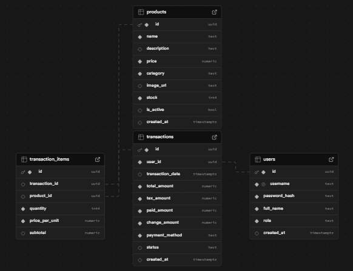
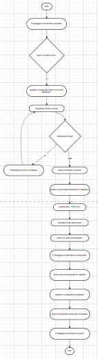

# EssyCoff POS Cashier App

## Overview
EssyCoff adalah aplikasi Point of Sale (POS) modern untuk kedai kopi yang dibangun menggunakan Android Studio Chipmunk 2021.2.1 dengan bahasa pemrograman Java. Aplikasi ini dirancang untuk memudahkan proses transaksi dan manajemen inventori dengan antarmuka yang sederhana namun modern.

## Features

### 🔐 Authentication System
- Login dengan username dan password
- Role-based access (Staff/Kasir dan Manager)
- Session management dengan enkripsi
- Auto logout untuk keamanan

### 💰 Point of Sale (POS)
- Katalog produk dengan kategori (Kopi, Makanan, Minuman)
- Keranjang belanja interaktif
- Perhitungan otomatis subtotal, pajak (10%), dan total
- Multiple payment methods (Tunai, Kartu Debit, Kartu Kredit, E-Wallet)
- Proses checkout dengan validasi

### 📊 Transaction History
- Riwayat transaksi lengkap
- Filter berdasarkan role user
- Detail transaksi dengan status
- Refresh data real-time

### 🛠️ Manager Features
- **Product Management**: CRUD produk, update stok, toggle ketersediaan
- **Sales Reports**: Laporan penjualan harian, mingguan, bulanan
- **Analytics**: Statistik penjualan dan performa

## Technical Stack

### 🔧 Development Environment
- **IDE**: Android Studio Chipmunk 2021.2.1
- **Language**: Java
- **Min SDK**: API 24 (Android 7.0 Nougat)
- **Target SDK**: API 33 (Android 13)

### 📚 Dependencies
- **AndroidX**: Core, AppCompat, ConstraintLayout
- **Material Design**: Components untuk UI modern
- **Navigation**: Fragment navigation
- **Lifecycle**: ViewModel dan LiveData
- **Networking**: OkHttp untuk REST API calls
- **JSON**: Gson untuk parsing
- **Image Loading**: Glide
- **Security**: Encrypted SharedPreferences

### 🗄️ Backend Integration
- **Database**: Supabase (PostgreSQL)
- **Authentication**: Supabase Auth
- **REST API**: Custom endpoints untuk CRUD operations

## Project Structure

```
app/src/main/java/com/example/essycoff_cashier/
├── activities/
│   └── LoginActivity.java          # Login screen
├── fragments/
│   ├── POSFragment.java           # Main POS interface
│   ├── TransactionHistoryFragment.java
│   ├── ProductManagementFragment.java
│   └── ReportsFragment.java
├── adapters/
│   ├── ProductAdapter.java        # Product grid adapter
│   ├── CartAdapter.java          # Shopping cart adapter
│   ├── TransactionAdapter.java   # Transaction history adapter
│   └── ProductManagementAdapter.java
├── models/
│   ├── User.java                 # User model with roles
│   ├── Product.java              # Product model
│   ├── CartItem.java            # Cart item model
│   └── Transaction.java         # Transaction model
├── database/
│   └── SupabaseClient.java      # REST API client
├── utils/
│   └── SessionManager.java      # Session management
├── dialogs/
│   └── PaymentDialog.java       # Payment processing dialog
└── MainActivity.java            # Main activity with navigation
```

## Application Flow

### Flowchart

Berikut adalah diagram alur sistem EssyCoff POS:



## Database Schema

### ERD (Entity Relationship Diagram)

Berikut adalah diagram skema database EssyCoff:



### Database Tables

### Users Table
```sql
CREATE TABLE users (
    id SERIAL PRIMARY KEY,
    username VARCHAR(50) UNIQUE NOT NULL,
    password VARCHAR(255) NOT NULL,
    full_name VARCHAR(100) NOT NULL,
    role VARCHAR(20) NOT NULL CHECK (role IN ('staff', 'manager')),
    is_active BOOLEAN DEFAULT true,
    created_at TIMESTAMP DEFAULT CURRENT_TIMESTAMP
);
```

### Products Table
```sql
CREATE TABLE products (
    id SERIAL PRIMARY KEY,
    name VARCHAR(100) NOT NULL,
    category VARCHAR(50) NOT NULL,
    price DECIMAL(10,2) NOT NULL,
    stock INTEGER DEFAULT 0,
    is_available BOOLEAN DEFAULT true,
    image_url VARCHAR(255),
    created_at TIMESTAMP DEFAULT CURRENT_TIMESTAMP,
    updated_at TIMESTAMP DEFAULT CURRENT_TIMESTAMP
);
```

### Transactions Table
```sql
CREATE TABLE transactions (
    id SERIAL PRIMARY KEY,
    transaction_number VARCHAR(50) UNIQUE NOT NULL,
    cashier_id INTEGER REFERENCES users(id),
    subtotal DECIMAL(10,2) NOT NULL,
    tax_amount DECIMAL(10,2) NOT NULL,
    total_amount DECIMAL(10,2) NOT NULL,
    payment_method VARCHAR(20) NOT NULL,
    payment_amount DECIMAL(10,2) NOT NULL,
    change_amount DECIMAL(10,2) DEFAULT 0,
    status VARCHAR(20) DEFAULT 'completed',
    created_at TIMESTAMP DEFAULT CURRENT_TIMESTAMP
);
```

### Transaction Items Table
```sql
CREATE TABLE transaction_items (
    id SERIAL PRIMARY KEY,
    transaction_id INTEGER REFERENCES transactions(id),
    product_id INTEGER REFERENCES products(id),
    quantity INTEGER NOT NULL,
    unit_price DECIMAL(10,2) NOT NULL,
    subtotal DECIMAL(10,2) NOT NULL,
    notes TEXT
);
```

## Setup Instructions

### 1. Prerequisites
- Android Studio Chipmunk 2021.2.1 atau lebih baru
- Java JDK 8 atau lebih baru
- Android SDK API 24+
- Supabase account dan project

### 2. Clone Repository
```bash
git clone <repository-url>
cd EssyCoffCashier
```

### 3. Supabase Configuration
1. Buat project baru di [Supabase](https://supabase.com)
2. Setup database dengan schema di atas
3. Dapatkan API URL dan API Key
4. Update `SupabaseClient.java` dengan credentials Anda:
```java
private static final String SUPABASE_URL = "YOUR_SUPABASE_URL";
private static final String SUPABASE_KEY = "YOUR_SUPABASE_ANON_KEY";
```

### 4. Build & Run
1. Open project di Android Studio
2. Sync Gradle files
3. Build project
4. Run pada device/emulator

## Default Login Credentials

### Manager Account
- **Username**: `manager`
- **Password**: `manager123`
- **Role**: Manager (Full access)

### Staff Account
- **Username**: `staff`
- **Password**: `staff123`
- **Role**: Staff/Kasir (Limited access)

## Key Features Implementation

### 🎨 Modern UI/UX
- Material Design 3 components
- Coffee shop themed color palette
- Responsive layouts untuk berbagai screen sizes
- Smooth animations dan transitions

### 🔒 Security
- Encrypted SharedPreferences untuk session data
- Password hashing (implementasi di backend)
- Session timeout dan auto-logout
- Role-based access control

### 📱 User Experience
- Intuitive navigation dengan BottomNavigationView
- Real-time cart updates
- Loading states dan error handling
- Toast notifications untuk feedback

### 🚀 Performance
- Efficient RecyclerView dengan ViewHolder pattern
- Image caching dengan Glide
- Async network operations
- Memory-efficient data handling

## Testing

### Manual Testing Checklist
- [ ] Login dengan berbagai role
- [ ] Add/remove items dari cart
- [ ] Proses checkout dengan berbagai payment methods
- [ ] View transaction history
- [ ] Product management (Manager only)
- [ ] Reports dan analytics (Manager only)
- [ ] Session timeout handling
- [ ] Network error handling

## Future Enhancements

### 🔮 Planned Features
- [ ] Receipt printing via Bluetooth
- [ ] Barcode scanning untuk produk
- [ ] Inventory alerts untuk low stock
- [ ] Customer management system
- [ ] Loyalty program integration
- [ ] Multi-language support
- [ ] Dark mode theme
- [ ] Offline mode dengan sync

### 🛠️ Technical Improvements
- [ ] Unit tests dan UI tests
- [ ] CI/CD pipeline
- [ ] Code obfuscation
- [ ] Performance monitoring
- [ ] Crash reporting
- [ ] Analytics integration

## Contributing

1. Fork the repository
2. Create feature branch (`git checkout -b feature/AmazingFeature`)
3. Commit changes (`git commit -m 'Add some AmazingFeature'`)
4. Push to branch (`git push origin feature/AmazingFeature`)
5. Open Pull Request

## License

This project is licensed under the MIT License - see the [LICENSE](LICENSE) file for details.

## Support

Untuk pertanyaan atau dukungan, silakan hubungi:
- Email: support@essycoff.com
- GitHub Issues: [Create Issue](https://github.com/your-repo/issues)

---

**EssyCoff POS** - Simplifying Coffee Shop Operations ☕
